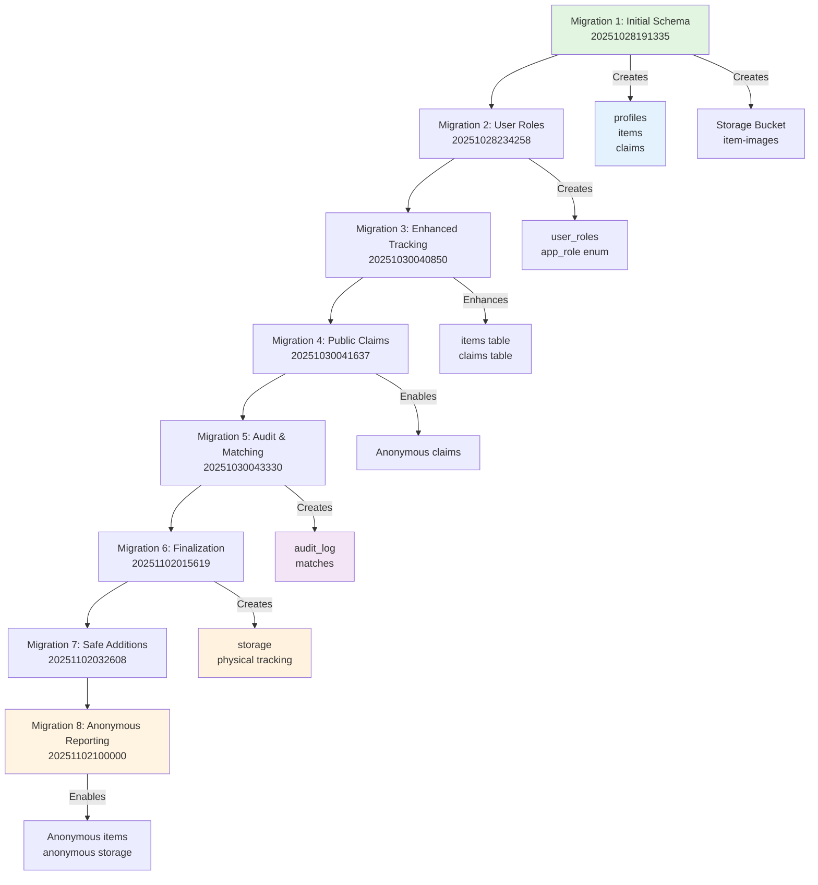
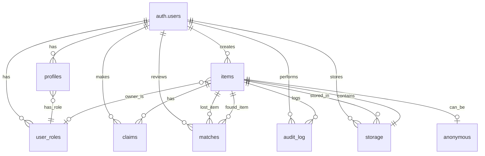

# Database Migration Documentation

## Lost & Found Hub - Supabase Schema Evolution

This document provides a comprehensive overview of all database migrations for the Lost & Found Hub project, showing the evolution of the schema from initial setup to the current production-ready state with anonymous reporting capabilities.

---

## Migration Timeline Flowchart



---

## Complete Database Schema

### Core Tables Overview

| Table Name | Purpose | Created | Modified |
|------------|---------|---------|----------|
| `profiles` | User profile information | Migration 1 | - |
| `user_roles` | User role assignments (staff/student) | Migration 2 | - |
| `items` | Lost and found items | Migration 1 | 3, 5, 6, 8 |
| `claims` | Item claim requests | Migration 1 | 3, 4, 6 |
| `matches` | Potential item matches | Migration 5 | 6, 7 |
| `audit_log` | System change tracking | Migration 5 | 6, 7 |
| `storage` | Physical storage tracking | Migration 6 | - |

---

## Table Definitions

### 1. profiles

**Purpose:** Extended user information linked to Supabase Auth

**Created:** Migration 1

**Schema:**
| Column | Type | Constraints | Description |
|--------|------|-------------|-------------|
| `id` | UUID | PRIMARY KEY, REFERENCES auth.users | User ID from Supabase Auth |
| `full_name` | TEXT | - | User's full name |
| `email` | TEXT | - | User's email address |
| `phone` | TEXT | - | User's phone number |
| `created_at` | TIMESTAMPTZ | DEFAULT NOW() | Profile creation timestamp |
| `updated_at` | TIMESTAMPTZ | DEFAULT NOW() | Last update timestamp |

**Triggers:**
- `update_profiles_updated_at` - Auto-updates `updated_at` on UPDATE

**RLS Policies:**
- **SELECT:** Users can view their own profile (`auth.uid() = id`)
- **UPDATE:** Users can update their own profile (`auth.uid() = id`)
- **INSERT:** Users can insert their own profile (`auth.uid() = id`)

**Auto-creation:** Triggered by `on_auth_user_created` when new user signs up

---

### 2. user_roles

**Purpose:** Defines user roles (staff vs student) for access control

**Created:** Migration 2

**Schema:**
| Column | Type | Constraints | Description |
|--------|------|-------------|-------------|
| `id` | UUID | PRIMARY KEY, DEFAULT gen_random_uuid() | Unique role assignment ID |
| `user_id` | UUID | REFERENCES auth.users, NOT NULL | User ID |
| `role` | app_role | NOT NULL | Role: 'staff' or 'student' |
| `created_at` | TIMESTAMPTZ | DEFAULT now() | Assignment timestamp |
| UNIQUE | (user_id, role) | - | One role per user |

**RLS Policies:**
- **SELECT:** Users can view their own role (`auth.uid() = user_id`)
- **INSERT:** Users can assign their own role on signup (`auth.uid() = user_id`)

**Functions:**
- `has_role(user_id, role)` - Returns boolean if user has specific role
- `get_user_role(user_id)` - Returns the user's role

---

### 3. items

**Purpose:** Core table for lost and found items

**Created:** Migration 1  
**Modified:** Migrations 3, 5, 6, 8

**Schema:**
| Column | Type | Constraints | Description |
|--------|------|-------------|-------------|
| `id` | UUID | PRIMARY KEY, DEFAULT gen_random_uuid() | Unique item ID |
| `user_id` | UUID | REFERENCES auth.users, **nullable** | Reporter's user ID (NULL for anonymous) |
| `status` | item_status | NOT NULL | Item status enum |
| `category` | item_category | NOT NULL | Item category enum |
| `title` | TEXT | NOT NULL | Item title |
| `description` | TEXT | NOT NULL | Detailed description |
| `location` | TEXT | NOT NULL | Lost/found location |
| `date_lost_found` | DATE | NOT NULL | When item was lost/found |
| `image_url` | TEXT | - | Image storage URL |
| `contact_info` | TEXT | - | Contact information |
| `is_active` | BOOLEAN | DEFAULT TRUE | Whether item is active |
| `is_anonymous` | BOOLEAN | DEFAULT FALSE | **Anonymous report flag** |
| `color` | TEXT | - | Item color *(Migration 3)* |
| `venue` | TEXT | - | Specific venue/building *(Migration 3)* |
| `container` | TEXT | - | Storage container location *(Migration 3)* |
| `identifying_details` | TEXT | - | Ownership verification details *(Migration 3)* |
| `storage_location` | TEXT | - | Physical storage location *(Migration 5)* |
| `storage_date` | TIMESTAMPTZ | - | Date stored *(Migration 5)* |
| `expiry_date` | DATE | - | Disposal date if unclaimed *(Migration 5)* |
| `created_at` | TIMESTAMPTZ | DEFAULT NOW() | Creation timestamp |
| `updated_at` | TIMESTAMPTZ | DEFAULT NOW() | Last update timestamp |

**Key Changes:**
- **Migration 3:** Added `color`, `venue`, `container`, `identifying_details`
- **Migration 5:** Added `storage_location`, `storage_date`, `expiry_date`
- **Migration 8:** Made `user_id` nullable, added `is_anonymous` flag

**Triggers:**
- `update_items_updated_at` - Auto-updates `updated_at` on UPDATE

**RLS Policies:**
- **SELECT:** 
  - Public can view active found items (`is_active = true AND status = 'found'`)
  - Users can view their own items (`auth.uid() = user_id`)
  - Staff can view anonymous reports (`is_anonymous = true AND role = 'staff'`)
- **INSERT:**
  - Authenticated users create their own items (`auth.uid() = user_id`)
  - Anonymous users can report lost items (`status = 'lost' AND user_id IS NULL AND is_anonymous = true`)
- **UPDATE:** Users can update their own items (`auth.uid() = user_id`)
- **DELETE:** Users can delete their own items (`auth.uid() = user_id`)

**Indexes:**
- `idx_items_user_id` (Migration 4)
- `idx_items_storage_location` (Migration 5)
- `idx_items_expiry_date` (Migration 5)

---

### 4. claims

**Purpose:** Item ownership claim requests from potential owners

**Created:** Migration 1  
**Modified:** Migrations 3, 4, 6

**Schema:**
| Column | Type | Constraints | Description |
|--------|------|-------------|-------------|
| `id` | UUID | PRIMARY KEY, DEFAULT gen_random_uuid() | Unique claim ID |
| `item_id` | UUID | REFERENCES items, NOT NULL | Item being claimed |
| `claimant_id` | UUID | REFERENCES auth.users, **nullable** | Claimant's user ID (NULL for anonymous) |
| `message` | TEXT | NOT NULL | Claim justification message |
| `status` | TEXT | DEFAULT 'pending' | Claim status |
| `first_name` | TEXT | - | Claimant's first name *(Migration 3)* |
| `last_name` | TEXT | - | Claimant's last name *(Migration 3)* |
| `phone` | TEXT | - | Claimant's phone *(Migration 3)* |
| `email` | TEXT | - | Claimant's email *(Migration 4)* |
| `lost_date` | DATE | - | When item was lost *(Migration 3)* |
| `lost_location` | TEXT | - | Where item was lost *(Migration 3)* |
| `venue` | TEXT | - | Venue where lost *(Migration 3)* |
| `reference_number` | TEXT | DEFAULT auto-generate | Unique claim reference *(Migration 3)* |
| `claim_date` | TIMESTAMPTZ | DEFAULT NOW() | Claim submission date *(Migration 6)* |
| `verification_status` | TEXT | DEFAULT 'pending' | Verification status *(Migration 6)* |
| `staff_notes` | TEXT | - | Internal staff notes *(Migration 6)* |
| `created_at` | TIMESTAMPTZ | DEFAULT NOW() | Creation timestamp |
| `updated_at` | TIMESTAMPTZ | DEFAULT NOW() | Last update timestamp |
| UNIQUE | (item_id, claimant_id) | - | One claim per user per item |

**Key Changes:**
- **Migration 3:** Added contact fields and reference number
- **Migration 4:** Made `claimant_id` nullable, added email field, enabled anonymous claims
- **Migration 6:** Added verification tracking fields

**Constraints:**
- `verification_status` CHECK: 'pending', 'verified', 'rejected'

**Triggers:**
- `update_claims_updated_at` - Auto-updates `updated_at` on UPDATE

**RLS Policies:**
- **SELECT:**
  - Users can view claims on their items (`item_id` in user's items)
  - Users can view their own claims (`auth.uid() = claimant_id`)
  - Staff can view all claims (`role = 'staff'`)
  - Public can view by reference number (`true`)
- **INSERT:**
  - Anyone can create claims (`true`) - **Anonymous submissions enabled**
- **UPDATE:**
  - Staff can update claims (`role = 'staff'`)

**Indexes:**
- `idx_claims_status` (Migration 4)
- `idx_claims_verification_status` (Migration 6)

---

### 5. matches

**Purpose:** Potential matches between lost and found items

**Created:** Migration 5  
**Modified:** Migration 6

**Schema:**
| Column | Type | Constraints | Description |
|--------|------|-------------|-------------|
| `id` | UUID | PRIMARY KEY, DEFAULT gen_random_uuid() | Unique match ID |
| `lost_item_id` | UUID | REFERENCES items | Lost item reference |
| `found_item_id` | UUID | REFERENCES items | Found item reference |
| `match_score` | INTEGER | DEFAULT 0 | Algorithm match score |
| `status` | TEXT | DEFAULT 'pending' | Match status |
| `match_algorithm` | TEXT | DEFAULT 'manual' | Match method *(Migration 6)* |
| `match_date` | TIMESTAMPTZ | DEFAULT NOW() | When match was created *(Migration 6)* |
| `reviewed_by` | UUID | REFERENCES auth.users | Staff who reviewed |
| `reviewed_at` | TIMESTAMPTZ | - | Review timestamp |
| `notes` | TEXT | - | Review notes |
| `created_at` | TIMESTAMPTZ | NOT NULL DEFAULT now() | Creation timestamp |
| `updated_at` | TIMESTAMPTZ | NOT NULL DEFAULT now() | Last update timestamp |

**Constraints:**
- `status` CHECK: 'pending', 'approved', 'rejected'
- `match_algorithm` CHECK: 'manual', 'AI', 'keyword'

**Triggers:**
- `update_matches_updated_at` - Auto-updates `updated_at` on UPDATE

**RLS Policies:**
- **SELECT:** Staff can view all matches (`role = 'staff'`)
- **INSERT:** Staff can create matches (`role = 'staff'`)
- **UPDATE:** Staff can update matches (`role = 'staff'`)

**Indexes:**
- `idx_matches_status` (Migration 5)
- `idx_matches_lost_item` (Migration 5)
- `idx_matches_found_item` (Migration 5)
- `idx_matches_algorithm` (Migration 6)

---

### 6. audit_log

**Purpose:** System audit trail for tracking changes

**Created:** Migration 5  
**Modified:** Migration 6

**Schema:**
| Column | Type | Constraints | Description |
|--------|------|-------------|-------------|
| `id` | UUID | PRIMARY KEY, DEFAULT gen_random_uuid() | Unique log ID |
| `item_id` | UUID | REFERENCES items | Item affected |
| `user_id` | UUID | REFERENCES auth.users | User who made change |
| `action` | TEXT | NOT NULL | Action description |
| `action_type` | TEXT | NOT NULL DEFAULT 'update' | Type of action *(Migration 6)* |
| `old_value` | JSONB | - | Previous state |
| `new_value` | JSONB | - | New state |
| `created_at` | TIMESTAMPTZ | NOT NULL DEFAULT now() | Creation timestamp |
| `timestamp` | TIMESTAMPTZ | NOT NULL DEFAULT NOW() | Action timestamp *(Migration 6)* |

**Constraints:**
- `action_type` CHECK: 'create', 'update', 'delete', 'claim', 'match', 'status_change'

**RLS Policies:**
- **SELECT:**
  - Staff can view all audit logs (`role = 'staff'`)
  - Users can view logs for their items (`item_id` in user's items)

**Indexes:**
- `idx_audit_log_item_id` (Migration 5)
- `idx_audit_log_created_at` (Migration 5)
- `idx_audit_log_action_type` (Migration 6)
- `idx_audit_log_timestamp` (Migration 6)

---

### 7. storage

**Purpose:** Physical storage tracking for items

**Created:** Migration 6

**Schema:**
| Column | Type | Constraints | Description |
|--------|------|-------------|-------------|
| `storage_id` | UUID | PRIMARY KEY, DEFAULT gen_random_uuid() | Unique storage ID |
| `item_id` | UUID | REFERENCES items, NOT NULL | Item stored |
| `location` | VARCHAR(255) | NOT NULL | Physical location (bin/shelf/room) |
| `stored_by` | UUID | REFERENCES auth.users | Staff member who stored |
| `storage_date` | TIMESTAMPTZ | NOT NULL DEFAULT NOW() | Storage date |
| `expiry_date` | DATE | - | Disposal date |
| `notes` | TEXT | - | Storage notes |
| `created_at` | TIMESTAMPTZ | NOT NULL DEFAULT NOW() | Creation timestamp |
| `updated_at` | TIMESTAMPTZ | NOT NULL DEFAULT NOW() | Last update timestamp |

**Triggers:**
- `update_storage_updated_at` - Auto-updates `updated_at` on UPDATE

**RLS Policies:** *(All staff-only)*
- **SELECT:** Staff can view all storage records
- **INSERT:** Staff can create storage records
- **UPDATE:** Staff can update storage records
- **DELETE:** Staff can delete storage records

**Indexes:**
- `idx_storage_item_id`
- `idx_storage_location`
- `idx_storage_date`
- `idx_storage_expiry`

---

## Custom Types (Enums)

### item_status

**Purpose:** Status of lost/found items

**Values:**
- `'lost'` - Item is lost
- `'found'` - Item has been found
- `'claimed'` - Item has been claimed
- `'returned'` - Item has been returned to owner

**Created:** Migration 1  
**Used in:** `items.status`

---

### item_category

**Purpose:** Categorization of items

**Values:**
- `'electronics'` - Electronic devices
- `'clothing'` - Clothing items
- `'accessories'` - Personal accessories
- `'books'` - Books and reading materials
- `'keys'` - Keys and keychains
- `'bags'` - Bags and luggage
- `'documents'` - Documents and IDs
- `'sports'` - Sports equipment
- `'other'` - Other items

**Created:** Migration 1  
**Used in:** `items.category`

---

### app_role

**Purpose:** User role for access control

**Values:**
- `'staff'` - Staff member with admin privileges
- `'student'` - Student user

**Created:** Migration 2  
**Used in:** `user_roles.role`

---

## Database Functions

### handle_new_user()

**Purpose:** Automatically create profile when new user signs up

**Type:** TRIGGER FUNCTION

**Created:** Migration 1

**Implementation:**
```sql
CREATE OR REPLACE FUNCTION public.handle_new_user()
RETURNS TRIGGER
LANGUAGE plpgsql
SECURITY DEFINER SET search_path = public
AS $$
BEGIN
  INSERT INTO public.profiles (id, email, full_name)
  VALUES (
    NEW.id,
    NEW.email,
    COALESCE(NEW.raw_user_meta_data->>'full_name', '')
  );
  RETURN NEW;
END;
$$;
```

**Trigger:** `on_auth_user_created` fires AFTER INSERT on `auth.users`

---

### update_updated_at_column()

**Purpose:** Universal timestamp update function for all tables

**Type:** TRIGGER FUNCTION

**Created:** Migration 1

**Implementation:**
```sql
CREATE OR REPLACE FUNCTION public.update_updated_at_column()
RETURNS TRIGGER
LANGUAGE plpgsql
AS $$
BEGIN
  NEW.updated_at = NOW();
  RETURN NEW;
END;
$$;
```

**Triggers:**
- `update_profiles_updated_at` on `profiles`
- `update_items_updated_at` on `items`
- `update_claims_updated_at` on `claims`
- `update_matches_updated_at` on `matches`
- `update_storage_updated_at` on `storage`

---

### has_role(user_id, role)

**Purpose:** Check if user has a specific role

**Type:** SECURITY DEFINER FUNCTION

**Created:** Migration 2

**Returns:** BOOLEAN

**Implementation:**
```sql
CREATE OR REPLACE FUNCTION public.has_role(_user_id UUID, _role app_role)
RETURNS BOOLEAN
LANGUAGE sql
STABLE
SECURITY DEFINER
SET search_path = public
AS $$
  SELECT EXISTS (
    SELECT 1
    FROM public.user_roles
    WHERE user_id = _user_id
      AND role = _role
  )
$$;
```

**Usage:** Check if user is staff or student

---

### get_user_role(user_id)

**Purpose:** Get user's role

**Type:** SECURITY DEFINER FUNCTION

**Created:** Migration 2

**Returns:** app_role

**Implementation:**
```sql
CREATE OR REPLACE FUNCTION public.get_user_role(_user_id UUID)
RETURNS app_role
LANGUAGE sql
STABLE
SECURITY DEFINER
SET search_path = public
AS $$
  SELECT role
  FROM public.user_roles
  WHERE user_id = _user_id
  LIMIT 1
$$;
```

**Usage:** Retrieve user's role for access control

---

## Storage Bucket Policies

### Bucket: item-images

**Purpose:** Store images for lost/found items

**Created:** Migration 1

**Public:** Yes (anyone can view)

**Policies:**

#### 1. Anyone can view item images (SELECT)
```sql
CREATE POLICY "Anyone can view item images"
ON storage.objects FOR SELECT
USING (bucket_id = 'item-images');
```
- **Role:** Everyone
- **Access:** Read images

#### 2. Authenticated users can upload images (INSERT)
```sql
CREATE POLICY "Authenticated users can upload item images"
ON storage.objects FOR INSERT
WITH CHECK (
  bucket_id = 'item-images' AND
  auth.role() = 'authenticated'
);
```
- **Role:** authenticated
- **Access:** Upload to own folder

#### 3. Anonymous users can upload lost item images (INSERT) *(Migration 8)*
```sql
CREATE POLICY "Anonymous users can upload lost item images"
ON storage.objects FOR INSERT
TO anon
WITH CHECK (
  bucket_id = 'item-images' AND
  (storage.foldername(name))[1] = 'anonymous'
);
```
- **Role:** anon
- **Access:** Upload to anonymous folder only

#### 4. Users can update their own images (UPDATE)
```sql
CREATE POLICY "Users can update their own item images"
ON storage.objects FOR UPDATE
USING (
  bucket_id = 'item-images' AND
  auth.uid()::text = (storage.foldername(name))[1]
);
```
- **Role:** authenticated
- **Access:** Update files in own folder

#### 5. Users can delete their own images (DELETE)
```sql
CREATE POLICY "Users can delete their own item images"
ON storage.objects FOR DELETE
USING (
  bucket_id = 'item-images' AND
  auth.uid()::text = (storage.foldername(name))[1]
);
```
- **Role:** authenticated
- **Access:** Delete files in own folder

---

## Complete RLS Policies Matrix

| Policy Name | Table | Operation | Role | Condition |
|-------------|-------|-----------|------|-----------|
| Users can view their own profile | profiles | SELECT | authenticated | `auth.uid() = id` |
| Users can update their own profile | profiles | UPDATE | authenticated | `auth.uid() = id` |
| Users can insert their own profile | profiles | INSERT | authenticated | `auth.uid() = id` |
| Users can view their own role | user_roles | SELECT | authenticated | `auth.uid() = user_id` |
| Only authenticated users can insert role | user_roles | INSERT | authenticated | `auth.uid() = user_id` |
| Public can view active found items | items | SELECT | anon | `is_active = true AND status = 'found'` |
| Authenticated users view own items | items | SELECT | authenticated | `auth.uid() = user_id` |
| Staff can view anonymous reports | items | SELECT | authenticated | `is_anonymous = true AND role = 'staff'` |
| Authenticated users create own items | items | INSERT | authenticated | `auth.uid() = user_id` |
| **Anonymous users report lost items** | items | INSERT | **anon** | **`status = 'lost' AND user_id IS NULL AND is_anonymous = true`** |
| Users can update their own items | items | UPDATE | authenticated | `auth.uid() = user_id` |
| Users can delete their own items | items | DELETE | authenticated | `auth.uid() = user_id` |
| Users view claims on their items | claims | SELECT | authenticated | `item_id` in user's items OR `auth.uid() = claimant_id` |
| Staff can view all claims | claims | SELECT | authenticated | `role = 'staff'` |
| Users can view claims by reference | claims | SELECT | - | `true` |
| **Anyone can create claims** | claims | INSERT | **-** | **`true`** |
| Staff can update claims | claims | UPDATE | authenticated | `role = 'staff'` |
| Staff can view all matches | matches | SELECT | authenticated | `role = 'staff'` |
| Staff can insert matches | matches | INSERT | authenticated | `role = 'staff'` |
| Staff can update matches | matches | UPDATE | authenticated | `role = 'staff'` |
| Staff can view all audit logs | audit_log | SELECT | authenticated | `role = 'staff'` |
| Users view audit logs for items | audit_log | SELECT | authenticated | `item_id` in user's items |
| Staff can view all storage records | storage | SELECT | authenticated | `role = 'staff'` |
| Staff can insert storage records | storage | INSERT | authenticated | `role = 'staff'` |
| Staff can update storage records | storage | UPDATE | authenticated | `role = 'staff'` |
| Staff can delete storage records | storage | DELETE | authenticated | `role = 'staff'` |
| Anyone can view item images | storage.objects | SELECT | - | `bucket_id = 'item-images'` |
| Auth users can upload images | storage.objects | INSERT | authenticated | `bucket_id = 'item-images'` |
| **Anonymous can upload lost images** | storage.objects | INSERT | **anon** | **`bucket_id = 'item-images' AND folder = 'anonymous'`** |
| Users update own images | storage.objects | UPDATE | authenticated | `folder = user_id` |
| Users delete own images | storage.objects | DELETE | authenticated | `folder = user_id` |

---

## Database Indexes

| Index Name | Table | Column(s) | Migration | Purpose |
|------------|-------|-----------|-----------|---------|
| `idx_claims_status` | claims | status | 4 | Fast claim status filtering |
| `idx_items_user_id` | items | user_id | 4 | Fast user item lookup |
| `idx_claims_verification_status` | claims | verification_status | 6 | Fast verification filtering |
| `idx_audit_log_item_id` | audit_log | item_id | 5 | Audit trail by item |
| `idx_audit_log_created_at` | audit_log | created_at | 5 | Time-based audit queries |
| `idx_audit_log_action_type` | audit_log | action_type | 6 | Filter by action type |
| `idx_audit_log_timestamp` | audit_log | timestamp | 6 | Temporal queries |
| `idx_matches_status` | matches | status | 5 | Match status filtering |
| `idx_matches_lost_item` | matches | lost_item_id | 5 | Find matches for lost item |
| `idx_matches_found_item` | matches | found_item_id | 5 | Find matches for found item |
| `idx_matches_algorithm` | matches | match_algorithm | 6 | Filter by algorithm type |
| `idx_items_storage_location` | items | storage_location | 5 | Storage location queries |
| `idx_items_expiry_date` | items | expiry_date | 5 | Find expired items |
| `idx_storage_item_id` | storage | item_id | 6 | Storage records by item |
| `idx_storage_location` | storage | location | 6 | Find items in location |
| `idx_storage_date` | storage | storage_date | 6 | Chronological queries |
| `idx_storage_expiry` | storage | expiry_date | 6 | Expired storage filtering |

---

## Schema Evolution Summary

### Phase 1: Foundation (Migration 1)
- ✅ Core user management with profiles
- ✅ Items table with basic tracking
- ✅ Claims system
- ✅ Storage bucket setup
- ✅ Timestamp automation

### Phase 2: Access Control (Migration 2)
- ✅ Role-based system
- ✅ Staff vs Student distinction
- ✅ Role checking functions

### Phase 3: Enhanced Tracking (Migration 3)
- ✅ Detailed item metadata (color, venue, container)
- ✅ Enhanced claims with contact info
- ✅ Public viewing of found items

### Phase 4: Public Access (Migration 4)
- ✅ Anonymous claim submissions
- ✅ Public claim viewing
- ✅ Performance indexing

### Phase 5: Advanced Features (Migration 5)
- ✅ Audit logging system
- ✅ Match detection system
- ✅ Storage tracking fields
- ✅ Comprehensive indexing

### Phase 6: Production Ready (Migration 6)
- ✅ Physical storage tracking
- ✅ Enhanced audit capabilities
- ✅ Match algorithm tracking
- ✅ Verification workflow

### Phase 7: Safety & Reliability (Migration 7)
- ✅ Conditional migrations
- ✅ Policy recreation safety
- ✅ Duplicate prevention

### Phase 8: Anonymous Reporting (Migration 8) ✨
- ✅ Students can report without login
- ✅ Anonymous item tracking
- ✅ Anonymous storage uploads
- ✅ Staff oversight of anonymous reports

---

## Access Control Matrix

### User Types & Capabilities

| Feature | Anonymous | Student | Staff |
|---------|-----------|---------|-------|
| **Browsing** |
| View found items | ✅ | ✅ | ✅ |
| Search & filter | ✅ | ✅ | ✅ |
| View item details | ✅ | ✅ | ✅ |
| **Reporting** |
| Report lost item | ✅ | ✅ | ✅ |
| Report found item | ❌ | ❌ | ✅ |
| Upload images | ✅ | ✅ | ✅ |
| Anonymous upload | ✅ | ❌ | ❌ |
| **Claiming** |
| Claim items | ✅ | ✅ | ✅ |
| View claims | By reference | Own claims | All claims |
| **Management** |
| View own items | ❌ | ✅ | ✅ |
| Update own items | ❌ | ✅ | ✅ |
| Delete own items | ❌ | ✅ | ✅ |
| View all items | ❌ | ❌ | ✅ |
| Approve/reject claims | ❌ | ❌ | ✅ |
| View matches | ❌ | ❌ | ✅ |
| Create matches | ❌ | ❌ | ✅ |
| View audit logs | ❌ | Own items | All logs |
| Manage storage | ❌ | ❌ | ✅ |
| View anonymous reports | ❌ | ❌ | ✅ |

---

## Migration Files Reference

| File | Date | Size | Lines | Focus |
|------|------|------|-------|-------|
| `20251028191335_*.sql` | Oct 28, 2025 | - | 171 | Initial schema, core tables |
| `20251028234258_*.sql` | Oct 28, 2025 | - | 57 | User roles system |
| `20251030040850_*.sql` | Oct 30, 2025 | - | 40 | Enhanced tracking fields |
| `20251030041637_*.sql` | Oct 30, 2025 | - | 48 | Public claims |
| `20251030043330_*.sql` | Oct 30, 2025 | - | 110 | Audit & matching |
| `20251102015619_*.sql` | Nov 2, 2025 | - | 146 | Finalization |
| `20251102032608_*.sql` | Nov 2, 2025 | - | 137 | Safe additions |
| `20251102100000_*.sql` | Nov 2, 2025 | - | 60 | Anonymous reporting |

---

## Entity Relationship Diagram



---

## Security Model

### Principle: Least Privilege

1. **Public (Anonymous) Access**
   - Read-only access to found items
   - Can submit lost item reports (anonymous)
   - Can submit claims
   - Cannot modify data

2. **Authenticated Student Access**
   - Everything public users can do
   - Manage own items (CRUD)
   - View own claims and audit logs
   - Cannot access staff features

3. **Staff Access**
   - Everything students can do
   - Full access to all data
   - Match management
   - Claim approval workflow
   - Storage management
   - Audit trail access
   - Anonymous report review

### RLS at Every Level

All tables enforce Row Level Security:
- No service role bypasses in policies
- All queries respect user context
- Anonymous operations are explicitly allowed
- Staff privileges are verified via role checking

---

## Performance Optimizations

### Indexing Strategy

1. **Primary Key Indexes** (automatic)
   - All UUID primary keys

2. **Foreign Key Indexes**
   - `user_id` on items (Migration 4)
   - `item_id` on storage (Migration 6)

3. **Query Optimization Indexes**
   - Status fields (claims, matches, items)
   - Timestamp fields (audit logs, storage)
   - Location fields (storage)

4. **Composite Indexes** (implicit)
   - None currently (consider adding for common query patterns)

### Query Patterns

**Most Common Queries:**
1. Find active found items by category/location
2. Get user's own items
3. Search claims by reference number
4. Find expired items for disposal
5. Staff dashboard aggregations

**All Indexed Appropriately** ✅

---

## Maintenance Notes

### Automated Triggers
- All `updated_at` fields automatically maintained
- Profile creation on signup

### Data Retention
- Items: `expiry_date` field for disposal tracking
- Storage: `expiry_date` for physical items
- Audit logs: Keep indefinitely for compliance

### Backup Strategy
- Regular Supabase automated backups
- Critical data: items, claims, matches
- High-value data: user_roles, profiles

### Monitoring Points
- Storage location queries (find expired)
- Match review queues
- Claim processing times
- Anonymous report volume

---

## Future Considerations

### Potential Enhancements

1. **Advanced Matching**
   - Add AI-based similarity scoring
   - Image recognition integration
   - Location proximity algorithms

2. **Notifications**
   - Email notifications for matches
   - SMS alerts for urgent items
   - Push notifications for students

3. **Analytics**
   - Dashboard metrics
   - Category trending
   - Return rate tracking
   - Campus hotspot mapping

4. **Integration**
   - Campus ID card verification
   - Payment system for storage fees
   - External lost & found services

---

## Version History

| Version | Date | Description |
|---------|------|-------------|
| 1.0.0 | Oct 28, 2025 | Initial schema |
| 1.1.0 | Oct 28, 2025 | Added role system |
| 1.2.0 | Oct 30, 2025 | Enhanced tracking |
| 1.3.0 | Oct 30, 2025 | Public claims |
| 1.4.0 | Oct 30, 2025 | Audit & matching |
| 1.5.0 | Nov 2, 2025 | Production ready |
| 1.5.1 | Nov 2, 2025 | Safety improvements |
| **2.0.0** | **Nov 2, 2025** | **Anonymous reporting** |

---

## Quick Reference

### Apply All Migrations
```bash
# Supabase CLI
supabase db reset

# Or migrate
supabase migration up
```

### Check Current Schema
```bash
supabase db dump --schema-only
```

### View RLS Policies
```sql
SELECT * FROM pg_policies WHERE schemaname = 'public';
```

### Check Table Sizes
```sql
SELECT 
  tablename,
  pg_size_pretty(pg_total_relation_size('public.'||tablename)) as size
FROM pg_tables
WHERE schemaname = 'public'
ORDER BY pg_total_relation_size('public.'||tablename) DESC;
```

---

## Support & Contact

For questions about the database schema:
- Review this documentation
- Check migration files for details
- Consult Supabase logs for errors
- Contact development team

---

**Document Version:** 2.0.0  
**Last Updated:** November 2, 2025  
**Schema Version:** 2.0.0 (Anonymous Reporting)  
**Status:** Production Ready ✅


